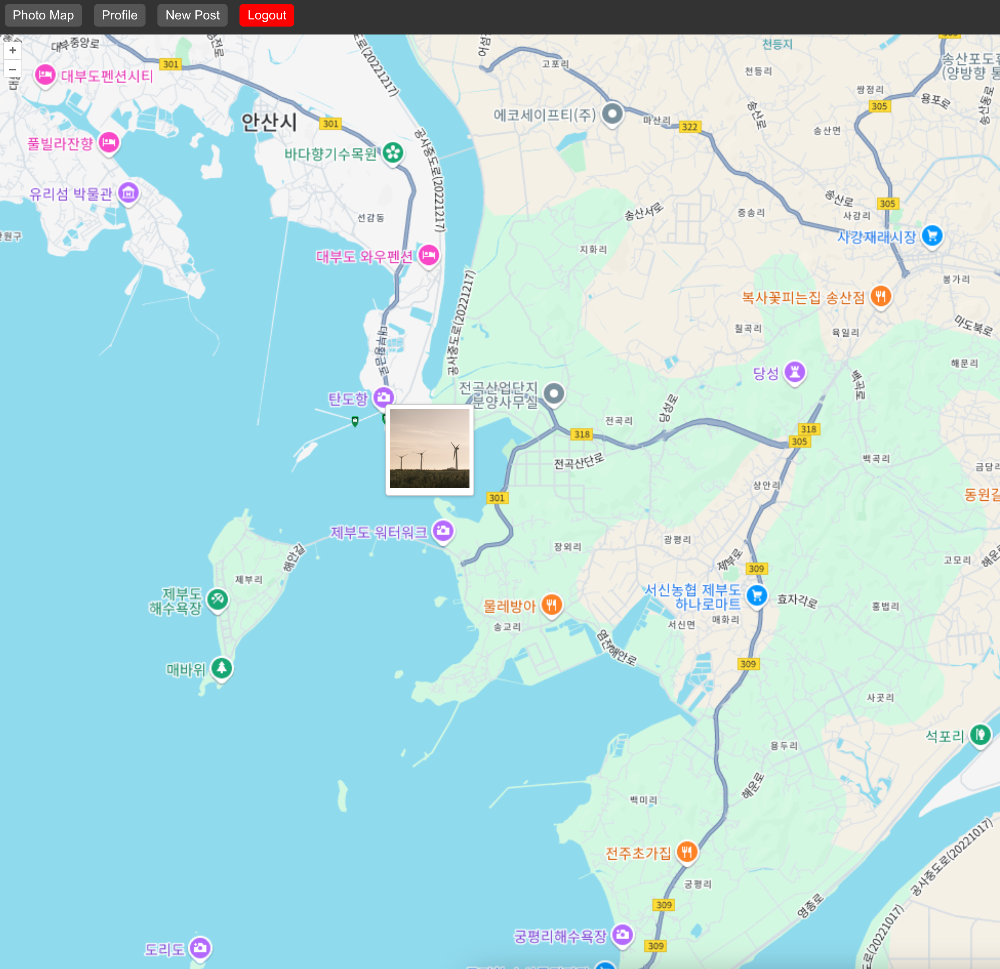
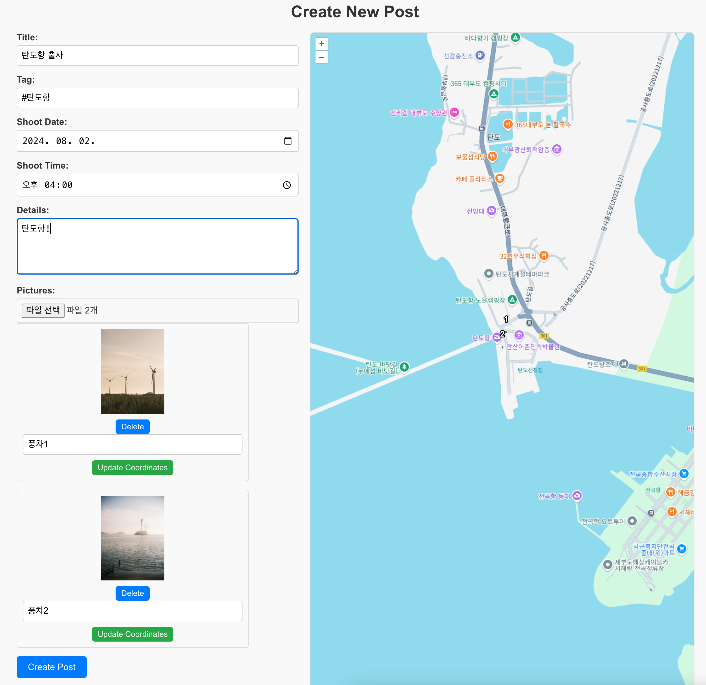
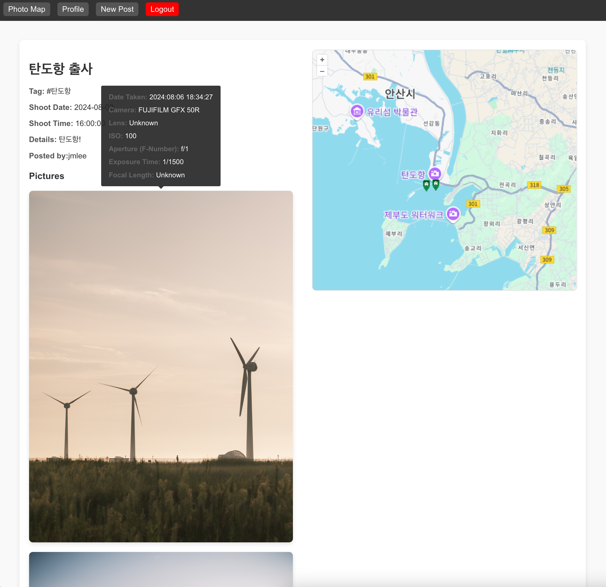
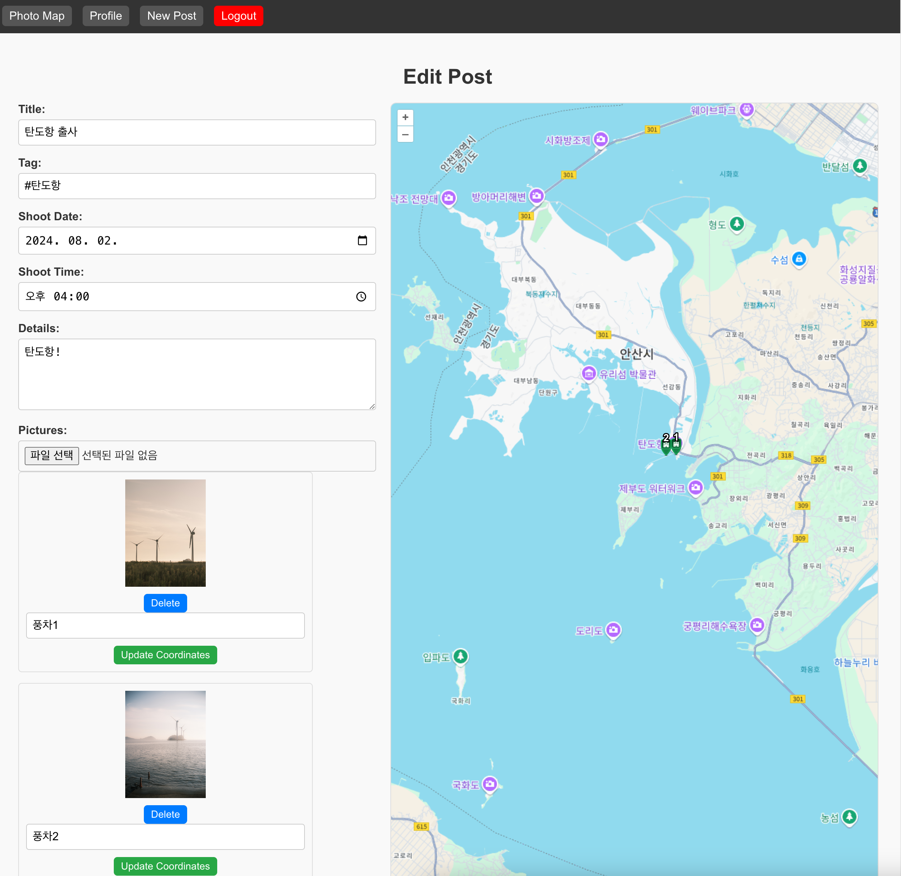
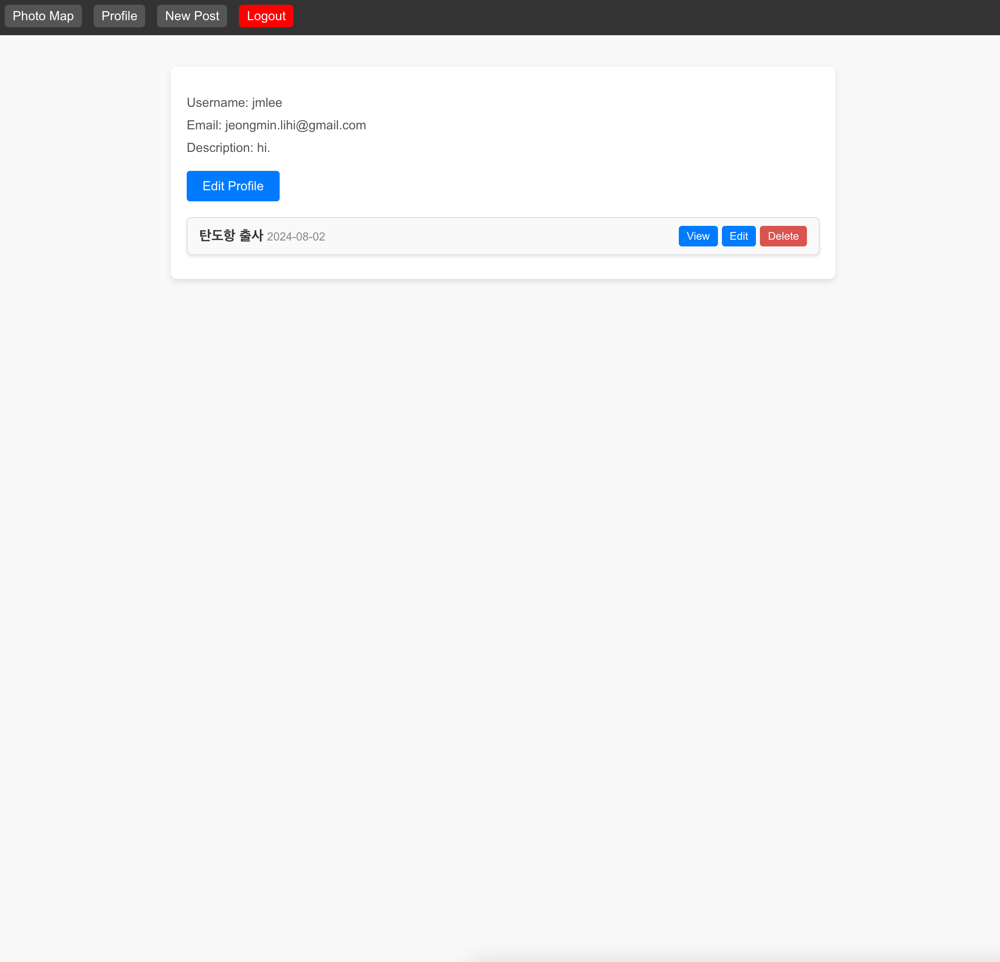

# PhotoMap-Front-End
**This is Back-End part of PhotoMap**
## What is PhotoMap?
PhotoMap은 사진가들을 위한 공간입니다.

일반적인 사진 공유 사이트와 달리, PhotoMap에서는 사진을 업로드하고, 출사 지도를 만들 수 있습니다.

회원가입, 로그인, 업로드, 수정, 삭제 기능을 지원하며, 메인페이지에서는 모든 유저가 올린 사진들을 하나의 지도에서 볼 수 있습니다.

Post 페이지에서는, 업로드한 사진들, 사진들의 메타데이터, 촬영한 장소를 볼 수 있습니다.

## Usage

## Project Files

### 1. domain

- picture: post에 들어있는 사진 한 장에 대한 모델
- post: 업로드한 post에 대한 모델
- user: user에 대한 모델
각 도메인은 'api, dto, model, repository, service, exception'을 가짐
### 2. auth
- SignInLogInFilter
- JWTAuthenticationFilter
- WebConfig
### 3. Api

## 공부한 내용들
- 자바 ORM 표준 JPA 프로그래밍(김영한)
- Spring Security in Action(로렌티우 스필카)

## 추후 구현 사항
- unit test
